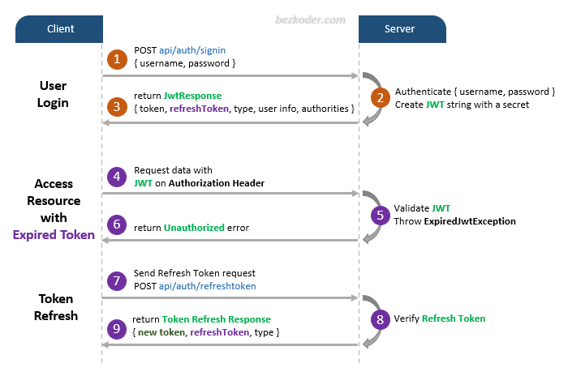

# Spring Boot JWT Authentication example with Spring Security & Spring Data JPA

## User Registration, User Login and Authorization process.
The diagram shows flow of how we implement User Registration, User Login and Authorization process.

## Spring Boot Server Architecture with Spring Security
You can have an overview of our Spring Boot Server with the diagram below:

For more detail, please visit:
> [Secure Spring Boot App with Spring Security & JWT Authentication](https://bezkoder.com/spring-boot-jwt-authentication/)

> [For MongoDB](https://bezkoder.com/spring-boot-jwt-auth-mongodb/)

## Refresh Token

For instruction: [Spring Boot Refresh Token with JWT example](https://bezkoder.com/spring-boot-refresh-token-jwt/)

